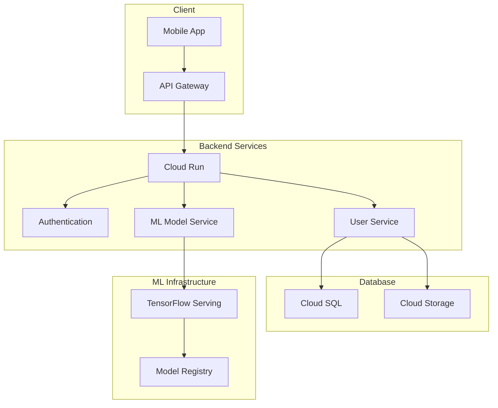
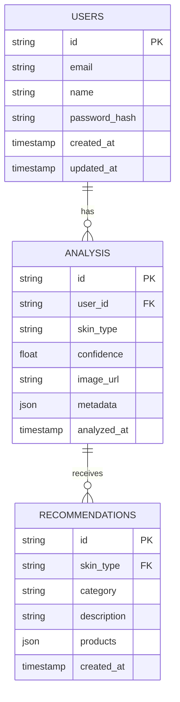
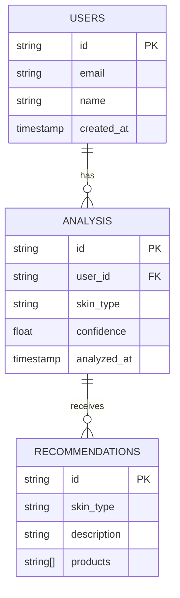

# CeKulit Backend API Documentation

<div align="center">
  
  <p><i>Cloud Infrastructure and Backend Services for AI-Powered Skin Analysis</i></p>
</div>

## Contents
- [Overview](#overview)
- [System Architecture](#system-architecture)
- [Tech Stack](#tech-stack)
- [Installation](#installation)
- [Endpoint Routes](#endpoint-routes)
- [Endpoint Documentation](#endpoint-documentation)
- [Infrastructure](#infrastructure)
- [Security](#security)
- [Deployment](#deployment)
- [Monitoring](#monitoring)
- [Progress Reports](#progress-reports)
- [Contributors](#contributors)

## Overview
CeKulit's backend infrastructure provides robust cloud services and APIs to support our AI-powered skin analysis application. Built on Google Cloud Platform, our architecture ensures scalable, secure, and reliable services for skin type classification and personalized skincare recommendations.

### Key Features
- Secure REST API endpoints with JWT authentication
- AI model deployment for skin analysis
- User management and profile system
- Analysis history tracking
- Personalized skincare recommendations
- Real-time processing capabilities
- Automated scaling and load balancing

## System Architecture


## Tech Stack

### Core Technologies
- Runtime: Node.js 18.x
- Framework: Express.js
- Database: Cloud SQL (PostgreSQL)
- Authentication: Firebase Auth
- Storage: Cloud Storage
- Deployment: Cloud Run
- ML Serving: TensorFlow Serving

## Installation

CeKulit requires [Node.js](https://nodejs.org/) v18+ to run.

### Installing Dependencies
```sh
npm install
```

### Environment Setup
```sh
# Copy environment template
cp .env.example .env

# Configure Google Cloud CLI
gcloud init
gcloud auth application-default login
```

### Starting Server
```sh
# Development mode with hot reload
npm run dev

# Production mode
npm run start
```

## Endpoint Routes

| HTTP Method | Path | Description | Section |
|------------|------|-------------|----------|
| POST | /api/v1/auth/register | User registration | Authentication |
| POST | /api/v1/auth/login | Login authorization | Authentication |
| POST | /api/v1/auth/logout | Logout authorization | Authentication |
| GET | /api/v1/users/profile | Get user profile | User |
| PATCH | /api/v1/users/profile | Update user profile | User |
| POST | /api/v1/analysis/skin-type | Process skin analysis | Analysis |
| GET | /api/v1/analysis/history | Get analysis history | Analysis |
| GET | /api/v1/analysis/{id} | Get specific analysis | Analysis |
| GET | /api/v1/recommendations | Get all recommendations | Recommendations |
| GET | /api/v1/recommendations/{skin_type} | Get skin-specific recommendations | Recommendations |

## Endpoint Documentation

### Authentication
All API requests (except registration and login) require authentication using Firebase JWT tokens:
```http
Authorization: Bearer <firebase_token>
```

#### Register
- Endpoint: `/api/v1/auth/register`
- Method: `POST`
- Request Body:
```json
{
    "name": "John Doe",
    "email": "john@example.com",
    "password": "securepass123",
    "passwordConfirm": "securepass123"
}
```
- Response (201 Created):
```json
{
    "status": "success",
    "message": "User registered successfully",
    "data": {
        "id": "user123",
        "name": "John Doe",
        "email": "john@example.com"
    }
}
```

#### Login
- Endpoint: `/api/v1/auth/login`
- Method: `POST`
- Request Body:
```json
{
    "email": "john@example.com",
    "password": "securepass123"
}
```
- Response (200 OK):
```json
{
    "status": "success",
    "message": "Login successful",
    "token": "firebase_jwt_token",
    "data": {
        "id": "user123",
        "name": "John Doe",
        "email": "john@example.com"
    }
}
```

### User Management

#### Get Profile
- Endpoint: `/api/v1/users/profile`
- Method: `GET`
- Response (200 OK):
```json
{
    "status": "success",
    "data": {
        "id": "user123",
        "name": "John Doe",
        "email": "john@example.com",
        "skinType": "combination",
        "analysisCount": 5,
        "createdAt": "2024-01-15T08:30:00Z"
    }
}
```

#### Update Profile
- Endpoint: `/api/v1/users/profile`
- Method: `PATCH`
- Request Body:
```json
{
    "name": "John Smith",
    "currentPassword": "oldpass123",
    "newPassword": "newpass123"
}
```
- Response (200 OK):
```json
{
    "status": "success",
    "message": "Profile updated successfully",
    "data": {
        "id": "user123",
        "name": "John Smith",
        "email": "john@example.com"
    }
}
```

### Skin Analysis

#### Process Analysis
- Endpoint: `/api/v1/analysis/skin-type`
- Method: `POST`
- Request Body: `multipart/form-data`
```
{
    "image": <file>,
    "additionalNotes": "Taken under natural lighting"
}
```
- Response (201 Created):
```json
{
    "status": "success",
    "message": "Analysis completed successfully",
    "data": {
        "id": "analysis123",
        "skinType": "combination",
        "confidence": 0.95,
        "imageUrl": "https://storage.googleapis.com/cekulit-analysis/user123/analysis123.jpg",
        "recommendations": [
            {
                "id": "rec123",
                "category": "cleanser",
                "description": "Use a gentle, non-foaming cleanser"
            }
        ],
        "createdAt": "2024-01-15T08:30:00Z"
    }
}
```

#### Get Analysis History
- Endpoint: `/api/v1/analysis/history`
- Method: `GET`
- Query Parameters:
  - `page`: Page number (default: 1)
  - `limit`: Items per page (default: 10)
  - `sortBy`: Sort field (default: createdAt)
  - `order`: Sort order (asc/desc, default: desc)
- Response (200 OK):
```json
{
    "status": "success",
    "data": {
        "items": [
            {
                "id": "analysis123",
                "skinType": "combination",
                "confidence": 0.95,
                "imageUrl": "https://storage.googleapis.com/cekulit-analysis/user123/analysis123.jpg",
                "createdAt": "2024-01-15T08:30:00Z"
            }
        ],
        "pagination": {
            "currentPage": 1,
            "totalPages": 3,
            "totalItems": 25,
            "itemsPerPage": 10
        }
    }
}
```

### Recommendations

#### Get All Recommendations
- Endpoint: `/api/v1/recommendations`
- Method: `GET`
- Response (200 OK):
```json
{
    "status": "success",
    "data": [
        {
            "id": "rec123",
            "skinType": "combination",
            "category": "cleanser",
            "description": "Use a gentle, non-foaming cleanser",
            "products": [
                {
                    "id": "prod123",
                    "name": "Gentle Cleanser",
                    "brand": "CeKulit",
                    "description": "Alcohol-free gentle cleanser"
                }
            ]
        }
    ]
}
```

## Infrastructure

### Database Schema


## Security

### Implementation
- JWT-based authentication using Firebase Auth
- Role-based access control (RBAC)
- Request rate limiting
- Input validation and sanitization
- SQL injection prevention
- XSS protection
- CORS configuration
- Secure headers implementation

### Best Practices
- Environment variable management
- Secure data transmission
- Regular security audits
- Automated vulnerability scanning

### Security Headers
```javascript
{
    "X-Frame-Options": "DENY",
    "X-Content-Type-Options": "nosniff",
    "X-XSS-Protection": "1; mode=block",
    "Content-Security-Policy": "default-src 'self'",
    "Strict-Transport-Security": "max-age=31536000; includeSubDomains"
}
```

### Rate Limiting
```javascript
{
    "window": "15m",
    "max": 100,
    "message": "Too many requests, please try again later.",
    "statusCode": 429
}
```

## Deployment

### Production Deployment
```bash
# Build Docker image
docker build -t cekulit-backend .

# Deploy to Cloud Run
gcloud run deploy cekulit-backend \
  --image gcr.io/cekulit/backend \
  --platform managed \
  --region asia-southeast1 \
  --allow-unauthenticated
```

### CI/CD Pipeline
```yaml
steps:
  - name: 'gcr.io/cloud-builders/docker'
    args: ['build', '-t', 'gcr.io/$PROJECT_ID/backend', '.']
  
  - name: 'gcr.io/cloud-builders/docker'
    args: ['push', 'gcr.io/$PROJECT_ID/backend']
  
  - name: 'gcr.io/google.com/cloudsdktool/cloud-sdk'
    entrypoint: gcloud
    args:
      - 'run'
      - 'deploy'
      - 'cekulit-backend'
      - '--image'
      - 'gcr.io/$PROJECT_ID/backend'
      - '--region'
      - 'asia-southeast1'
```

## Monitoring

### Key Metrics
- API response times
- Error rates
- Request volume
- Resource utilization
- User activity

### Alerting Configuration
```javascript
// Example alert policy
{
  "displayName": "High Error Rate Alert",
  "conditions": [{
    "displayName": "Error Rate > 5%",
    "conditionThreshold": {
      "filter": "metric.type=\"run.googleapis.com/request_count\"",
      "comparison": "COMPARISON_GT",
      "threshold": 5
    }
  }]
}
```

## Progress Reports

### Week 1: Infrastructure Setup ✅
- [x] Cloud environment configuration
- [x] Basic API structure
- [x] Database schema design

### Week 2: Core Development ✅
- [x] Authentication implementation
- [x] ML model deployment
- [x] API endpoint development

### Week 3: Integration 🚧
- [x] Mobile app integration
- [ ] Performance optimization
- [ ] Security hardening

### Week 4: Testing and Deployment 📋
- [ ] Load testing
- [ ] Documentation completion
- [ ] Production deployment

## Contributors

### Cloud Computing Team
- **Reynal Novriadi** (Universitas Riau)
  - Infrastructure Design
  - Auth Development
- **Fatahillah Alif Pangaribowo** (Institut Teknologi Dirgantara Adisutjipto)
  - API Development
  - DevOps
  - Security Implementation

### Technical Advisors
- Nurrahman Hadi
- Candra Reza Prasetya Gannes

## License
This project is licensed under the MIT License - see the [LICENSE](LICENSE.md) file for details.

## Acknowledgments
- WHO for global skin health statistics
- Anthropic for AI assistance
- Our university partners for resources and support
---

# CeKulit Backend Documentation

<div align="center">
  
  <p><i>Cloud Infrastructure and Backend Services for AI-Powered Skin Analysis</i></p>
</div>

## Table of Contents
- [Overview](#overview)
- [System Architecture](#system-architecture)
- [Tech Stack](#tech-stack)
- [Project Setup](#project-setup)
- [API Documentation](#api-documentation)
- [Infrastructure](#infrastructure)
- [Security](#security)
- [Deployment](#deployment)
- [Monitoring](#monitoring)
- [Progress Reports](#progress-reports)
- [Contributors](#contributors)

## Overview

CeKulit's backend infrastructure provides robust cloud services and APIs to support our AI-powered skin analysis application. Built on Google Cloud Platform, our architecture ensures scalable, secure, and reliable services for skin type classification and personalized skincare recommendations.

### Key Features
- Secure REST API endpoints
- AI model deployment infrastructure
- User authentication and authorization
- Data storage and management
- Real-time processing capabilities
- Automated scaling and load balancing

## System Architecture


## Tech Stack

### Core Technologies
- **Runtime**: Node.js 18.x
- **Framework**: Express.js
- **Database**: Cloud SQL (PostgreSQL)
- **Authentication**: Firebase Auth
- **Storage**: Cloud Storage
- **Deployment**: Cloud Run
- **ML Serving**: TensorFlow Serving

### Development Tools
- **Version Control**: Git
- **CI/CD**: Cloud Build
- **API Testing**: Postman
- **Documentation**: Swagger/OpenAPI
- **Monitoring**: Cloud Monitoring

## Project Setup

### Prerequisites
```bash
# Install Node.js dependencies
npm install

# Configure environment variables
cp .env.example .env

# Setup Google Cloud CLI
gcloud init
gcloud auth application-default login
```

### Local Development
```bash
# Start development server
npm run dev

# Run tests
npm run test

# Generate API documentation
npm run docs
```

## API Documentation

### Base URL
```
https://api.cekulit.app/v1
```

### Authentication
All API requests require authentication using Firebase JWT tokens:
```http
Authorization: Bearer <firebase_token>
```

### Endpoints

#### User Management
```http
POST   /auth/register
POST   /auth/login
GET    /users/profile
PATCH  /users/profile
```

#### Skin Analysis
```http
POST   /analysis/skin-type
GET    /analysis/history
GET    /analysis/{id}
```

#### Recommendations
```http
GET    /recommendations
GET    /recommendations/{skin_type}
```

## Infrastructure

### Google Cloud Resources

```markdown
┌────────────────────┬────────────────────────┐
│ Service            │ Purpose                │
├────────────────────┼────────────────────────┤
│ Cloud Run          │ API hosting            │
│ Cloud SQL          │ Database               │
│ Cloud Storage      │ Image storage          │
│ Cloud Functions    │ Serverless operations  │
│ Cloud Build        │ CI/CD pipeline         │
│ Cloud Monitoring   │ System monitoring      │
└────────────────────┴────────────────────────┘
```

### Database Schema



## Security

### Implementation
- JWT-based authentication
- Role-based access control
- Request rate limiting
- Input validation
- SQL injection prevention
- XSS protection

### Best Practices
- Environment variable management
- Secure data transmission
- Regular security audits
- Automated vulnerability scanning

## Deployment

### Production Deployment
```bash
# Build Docker image
docker build -t cekulit-backend .

# Deploy to Cloud Run
gcloud run deploy cekulit-backend \
  --image gcr.io/cekulit/backend \
  --platform managed \
  --region asia-southeast1 \
  --allow-unauthenticated
```

### CI/CD Pipeline
```yaml
steps:
  - name: 'gcr.io/cloud-builders/docker'
    args: ['build', '-t', 'gcr.io/$PROJECT_ID/backend', '.']
  
  - name: 'gcr.io/cloud-builders/docker'
    args: ['push', 'gcr.io/$PROJECT_ID/backend']
  
  - name: 'gcr.io/google.com/cloudsdktool/cloud-sdk'
    entrypoint: gcloud
    args:
      - 'run'
      - 'deploy'
      - 'cekulit-backend'
      - '--image'
      - 'gcr.io/$PROJECT_ID/backend'
      - '--region'
      - 'asia-southeast1'
```

## Monitoring

### Key Metrics
- API response times
- Error rates
- Request volume
- Resource utilization
- User activity

### Alerting Configuration
```javascript
// Example alert policy
{
  "displayName": "High Error Rate Alert",
  "conditions": [{
    "displayName": "Error Rate > 5%",
    "conditionThreshold": {
      "filter": "metric.type=\"run.googleapis.com/request_count\"",
      "comparison": "COMPARISON_GT",
      "threshold": 5
    }
  }]
}
```

## Progress Reports

### Week 1: Infrastructure Setup ✅
- [x] Cloud environment configuration
- [x] Basic API structure
- [x] Database schema design

### Week 2: Core Development ✅
- [x] Authentication implementation
- [x] ML model deployment
- [x] API endpoint development

### Week 3: Integration 🚧
- [x] Mobile app integration
- [ ] Performance optimization
- [ ] Security hardening

### Week 4: Testing and Deployment 📋
- [ ] Load testing
- [ ] Documentation completion
- [ ] Production deployment

## Contributors

### Cloud Computing Team
- **Reynal Novriadi** (Universitas Riau)
  - Infrastructure Design
  - Auth Development
- **Fatahillah Alif Pangaribowo** (Institut Teknologi Dirgantara Adisutjipto)
  - API Development
  - DevOps
  - Security Implementation

### Technical Advisors
- Nurrahman Hadi
- Candra Reza Prasetya Gannes

## License
This project is licensed under the MIT License - see the [LICENSE](LICENSE.md) file for details.

## Acknowledgments
- WHO for global skin health statistics
- Anthropic for AI assistance
- Our university partners for resources and support

---

<div align="center">
  <p>Made with ❤️ by CeKulit Team</p>
  <p>© 2024 CeKulit. All rights reserved.</p>
</div>
